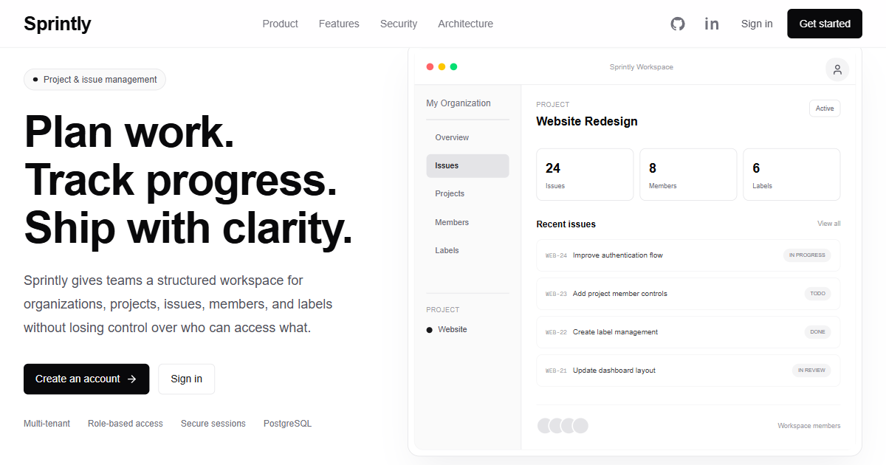

# Sprintly

> A production-grade, multi-tenant project and issue management platform built with Next.js, TypeScript, PostgreSQL, and Drizzle ORM.



## 🌐 Live Demo:     [**Visit Sprintly →**](https://my-sprintly.vercel.app)


Sprintly is a modern project and issue management application designed to help teams organize projects, track work, manage issues, collaborate through structured workflows, and control access through organization-level role-based permissions.

The project is being built with a **production-first architecture**, focusing on security, maintainability, scalability, clean separation of concerns, and real-world SaaS engineering practices.

---

## Table of Contents

- [Overview](#overview)
- [Why Sprintly](#why-sprintly)
- [Core Features](#core-features)
- [Multi-Tenancy](#multi-tenancy)
- [Authentication](#authentication)
- [RBAC - Role-Based Access Control](#Role-Based-Access-Control)
- [Projects](#projects)
- [Issues and Workflow](#issues)
- [Labels](#labels)
- [Database Design](#database-design)
- [API Architecture](#api-architecture)
- [Security](#security)
- [Validation](#validation)
- [Error Handling](#error-handling)
- [Pagination and Filtering](#pagination)
- [Frontend Architecture](#frontend-architecture)
- [Environment Variables](#environment-variables)
- [Local Development](#local-development)
- [Database Setup](#database-setup)
- [Engineering Principles](#engineering-principles)
- [Future Improvements](#future-improvements)
- [License](#license)

---

# Overview

Sprintly is a multi-tenant SaaS-style project management system.

The application allows users to:

- Create accounts
- Create and manage organizations
- Invite organization members
- Assign organization roles
- Create projects
- Manage project membership
- Create and manage issues
- Assign issues to project members
- Track issue status
- Set issue priorities
- Add due dates
- Create organization-level labels
- Attach labels to issues
- Filter and sort issues
- Manage access using role-based permissions

The application is designed around an organization → project → issue hierarchy.

```text
User
 │
 ├── Organization
 │      │
 │      ├── Members
 │      │
 │      ├── Projects
 │      │      │
 │      │      ├── Project Members
 │      │      │
 │      │      └── Issues
 │      │             │
 │      │             └── Labels
 │      │
 │      └── Organization Labels
 │
 └── Other Organizations
```

This structure provides a foundation for a real multi-tenant application where users can belong to multiple organizations while maintaining strict data isolation between tenants.

---

# Why Sprintly

Sprintly is not intended to be a simple CRUD demonstration.

The project is designed to provide practical experience with the engineering challenges found in production SaaS applications, including:

- Multi-tenancy
- Authentication
- Session management
- Password security
- Role-based access control
- Resource-level authorization
- Database relationships
- Transactional operations
- API design
- Runtime validation
- Pagination
- Filtering
- Query optimization
- Security boundaries
- Error handling
- Responsive application architecture
- Scalable project organization

The goal is to build an application that can serve as both a serious portfolio project and a foundation for future expansion.

---

# Core Features

## Authentication

Users can:

- User registration
- User login
- User logout
- Current authenticated user
- Session-based authentication
- Argon2 password hashing
- Secure HttpOnly cookies

Authentication is session-based rather than exposing authentication tokens to client-side JavaScript.

---

## Organizations

Organizations represent independent workspaces.

Users can:

- Create organizations
- View organizations
- View organization details
- Update organization information
- Delete organizations
- Organization membership
- Organization roles
- Member management

Organizations provide the primary tenant boundary within the application.

---

## Organization Invitations

Organization members with appropriate permissions can invite users through link-based invitations.

- Invite organization members
- Secure invitation tokens
- Invitation expiration
- Invitation acceptance
- Prevention of reused invitations
- Organization membership creation after acceptance

Invitation tokens are generated using cryptographically secure randomness.

Invitations:

- Expire
- Can only be accepted appropriately
- Cannot be reused after acceptance
- Create an organization membership after successful acceptance

---

## Role-Based Access Control

Sprintly supports four organization roles:

| Role   | Description                             |
| ------ | --------------------------------------- |
| OWNER  | Full organization control               |
| ADMIN  | Administrative organization permissions |
| MEMBER | Standard workspace member               |
| VIEWER | Read-oriented access                    |

Permissions are centralized rather than scattered throughout API routes.

---

# Projects

Projects belong to organizations.

- Create projects
- List projects
- View project details
- Update projects
- Archive projects
- Delete projects
- Project keys
- Project membership

# Project Membership

Projects have their own membership layer.

A user may belong to an organization without necessarily being a member of every project within that organization.

This allows project-level access control and assignment rules.

For example:

```text
Organization
 │
 ├── Alice
 ├── Bob
 ├── Charlie
 │
 ├── Website Project
 │      ├── Alice
 │      └── Bob
 │
 └── Mobile Project
        ├── Bob
        └── Charlie
```

This distinction is important for ensuring that issues are not assigned to arbitrary organization users who do not belong to the relevant project.

---

# Issues

Issues are the primary unit of work in Sprintly.

Each issue contains:

- Issue ID
- Project
- Issue number
- Title
- Description
- Status
- Priority
- Assignee
- Reporter
- Due date
- Creation timestamp
- Updated timestamp

An issue identifier is generated using its project's key.

---

# Issue Workflow

Sprintly uses a structured issue workflow:

```text
BACKLOG
   ↓
TODO
   ↓
IN_PROGRESS
   ↓
IN_REVIEW
   ↓
DONE
```

---

# Issue Priorities

Issues support four priority levels:

```text
LOW
MEDIUM
HIGH
URGENT
```

Priority can be used for both organization of work and filtering.

---

# Issue Assignment

Issues can optionally be assigned to a user.

Assignment is validated against the project membership rules.

A user cannot simply be assigned an issue because they exist in the database.

The system verifies that the intended assignee:

1. Exists
2. Belongs to the relevant organization
3. Is a member of the relevant project

This prevents cross-project and cross-organization assignment vulnerabilities.

---

# Labels

Labels are organization-scoped metadata that can be attached to issues.

Examples:

```text
bug
feature
frontend
backend
security
urgent
documentation
```

Issues can have multiple labels.
The many-to-many relationship is represented using an issue-label join table.

---

# Database Design

Sprintly uses PostgreSQL as its relational database.

The primary entities are:

```text
users
organizations
organization_members
organization_invitations
sessions
projects
project_members
issues
labels
issue_labels
```

## Relationship Overview

```text
users
 │
 ├───────────────┐
 │               │
 ▼               ▼
sessions    organization_members
                 │
                 ▼
          organizations
             │       │
             │       ├── labels
             │
             ▼
          projects
             │
             ├── project_members
             │
             ▼
           issues
             │
             ▼
        issue_labels
             │
             ▼
           labels
```

---

# Database Technology

Sprintly uses:

- PostgreSQL
- Drizzle ORM
- PostgreSQL driver
- Drizzle Kit for migrations

The database schema is defined using TypeScript and managed through Drizzle migrations.

---

# Transactions

Operations that modify multiple related records use database transactions where consistency requires it.

Examples include:

- Creating an organization and its OWNER membership
- Accepting an invitation
- Creating a project and its initial membership
- Replacing issue labels
- Other multi-step operations that must succeed or fail atomically

The objective is to avoid partially completed state.

---

# Authentication

Sprintly uses session-based authentication.

## Registration

The registration flow is:

```text
Client
  ↓
Validate input
  ↓
Normalize email
  ↓
Check duplicate account
  ↓
Hash password with bcrypt
  ↓
Create user
  ↓
Create session
  ↓
Set secure cookie
```

Passwords are never stored as plaintext.

---

## Login

The login flow is:

```text
Client
  ↓
Validate credentials
  ↓
Normalize email
  ↓
Find user
  ↓
Verify bcrypt password hash
  ↓
Create session
  ↓
Set secure cookie
```

Authentication failures use generic responses rather than exposing unnecessary information.

---

## Sessions

Sessions contain:

- Session ID
- User ID
- Expiration time
- Creation time

Session identifiers are generated using cryptographically secure randomness.

---

# Authorization

The authorization flow is conceptually:

```text
Request
   ↓
Authenticate
   ↓
Identify organization
   ↓
Verify resource ownership / tenancy
   ↓
Verify membership
   ↓
Check permission
   ↓
Perform operation
```

This prevents authorization decisions from being based only on frontend UI state.

---

# Multi-Tenancy

Sprintly uses organization-based multi-tenancy.

Every organization represents a logical tenant.

Resources are scoped to organizations through relationships such as:

```text
Organization
   ↓
Project
   ↓
Issue
```

and:

```text
Organization
   ↓
Label
```

The API verifies relationships before operating on resources.

For example, possessing:

```text
organizationId
projectId
issueId
```

is not enough to access an issue.

The server verifies that:

```text
issue → project
project → organization
user → organization
```

are all valid relationships.

This is an important part of preventing IDOR/BOLA-style authorization vulnerabilities.

---

# API Architecture

The application follows a layered architecture.

Conceptually:

```text
HTTP Request
     ↓
Next.js API Route
     ↓
Validation
     ↓
Authentication
     ↓
Authorization
     ↓
Service Layer
     ↓
Drizzle ORM
     ↓
PostgreSQL
```

API routes are intentionally kept thin.

Business logic belongs primarily in feature services rather than being duplicated across route handlers.

---

# Feature-Based Architecture

Application features are organized around domains.

```text
src/features/
├── auth/
├── organizations/
├── projects/
├── issues/
└── labels/
```

A typical feature contains responsibilities such as:

```text
feature/
├── service
├── validation
├── types
├── hooks
└── components
```

This makes features easier to develop, test, and maintain independently.

---

# Error Handling

Application errors are represented using explicit error categories.

Examples include:

```text
UNAUTHORIZED
FORBIDDEN
NOT_FOUND
VALIDATION_ERROR
CONFLICT
BAD_REQUEST
INTERNAL_ERROR
```

The API maps these errors to appropriate HTTP status codes.

For example:

```text
401 → unauthenticated
403 → authenticated but insufficient permissions
404 → resource not found / intentionally hidden
400 → invalid request
409 → conflicting resource state
500 → unexpected server failure
```

Database errors and stack traces are not returned directly to clients.

---

# Validation

Sprintly uses **Zod** for runtime validation.

TypeScript provides compile-time safety, but API requests originate outside the TypeScript type system.

Therefore, request boundaries are validated at runtime.

Validation covers areas such as:

- Request bodies
- Route parameters
- Query parameters
- UUIDs
- Enums
- Dates
- Pagination
- Project keys
- Organization slugs
- Label colors

The general pattern is:

```text
External Input
      ↓
Zod Validation
      ↓
Typed Application Data
      ↓
Business Logic
```

---

# Pagination

List endpoints use database-level pagination rather than loading entire datasets into application memory.

The general query format is:

```text
?page=1&limit=20
```

A maximum page size is enforced to prevent unnecessarily large requests.

Pagination responses include metadata such as:

```text
page
limit
total
totalPages
```

---

# Filtering and Sorting

Issue listing supports filtering and sorting.

Typical filters include:

```text
status
priority
assigneeId
labelId
search
```

Sorting can be performed using supported issue fields such as:

```text
createdAt
updatedAt
dueDate
number
priority
```

Filtering and sorting are performed through database queries rather than fetching all records and processing them in application memory.

---

# Security

Security is treated as an application-wide concern.

Important security measures include:

- bcrypt password hashing
- Secure authentication cookies
- HttpOnly session cookies
- SameSite cookie configuration
- Runtime request validation
- Centralized authorization
- Tenant isolation
- Permission checks
- Secure random session tokens
- Secure random invitation tokens
- Generic authentication failures
- No raw database errors exposed
- Security headers
- Environment-based secrets
- Avoiding sensitive logging

---

# Frontend Architecture

The frontend is built using Next.js and TypeScript.

The application uses:

- Server Components by default
- Client Components where interaction requires them
- Feature-oriented frontend organization
- Shared UI primitives
- Centralized API communication

The frontend is structured around authenticated and unauthenticated application areas.

Conceptually:

```text
src/app/
├── (auth)/
│   ├── login/
│   └── register/
│
└── (protected)/
    ├── dashboard/
    ├── organizations/
    └── ...
```

---

# Frontend Components

Reusable components are separated from feature-specific components.

```text
src/components/
├── ui/
├── layout/
└── shared/
```

---

# Environment Variables

Create a local environment file based on the example configuration.

```text
DATABASE_URL=your_postgresql_connection_string
NODE_ENV=development
```

---

# Local Development

## Prerequisites

Install:

- Node.js
- npm
- PostgreSQL
- Git

Verify Node.js:

```bash
node -v
```

Verify npm:

```bash
npm -v
```

Verify PostgreSQL:

```bash
psql --version
```

---

# Installation

Clone the repository:

```bash
git clone https://github.com/BharatBhati14/Sprintly
```

Enter the project directory:

```bash
cd sprintly
```

Install dependencies:

```bash
npm install
```

Create your local environment file:

```text
.env.local
```

Configure the required environment variables.

---

# Database Setup

Make sure PostgreSQL is running.

Configure:

```text
DATABASE_URL
```

Run database migrations:

```bash
npx drizzle-kit migrate
```

The application should then be able to connect to PostgreSQL.

---

# Development Server

Start the Next.js development server:

```bash
npm run dev
```

The application will normally be available at:

```text
http://localhost:3000
```

---

# Database Development Workflow

When modifying the database schema:

1. Update the relevant schema file.
2. Generate a migration.
3. Review the generated migration.
4. Apply the migration.
5. Verify the resulting database structure.
6. Run TypeScript checks.
7. Run linting.
8. Test affected functionality.
9. Commit the schema and migration together.

Generate a migration:

```bash
npx drizzle-kit generate
```

Apply migrations:

```bash
npx drizzle-kit migrate
```

---

# Engineering Principles

Sprintly follows several engineering principles.

## Feature-First Architecture

Code is organized around business capabilities rather than only technical file types.

```text
features/
├── auth
├── organizations
├── projects
├── issues
└── labels
```

---

## Separation of Concerns

Responsibilities are separated between:

```text
Routes
Validation
Authorization
Services
Database
UI
```

A route should not become a large collection of business logic.

---

## SOLID

The project aims to follow SOLID principles where they provide practical value.

In particular:

- Single Responsibility
- Dependency management
- Small focused modules
- Explicit interfaces between application layers

---

## DRY

Repeated behavior should be centralized when appropriate.

Examples include:

- Authentication helpers
- Permission checks
- API responses
- Error handling
- Validation utilities
- Database access patterns

DRY does not mean forcing unrelated code into overly generic abstractions.

---

## Security by Default

Security checks should happen on the server.

Frontend behavior should never be considered an authorization boundary.

---

## Scalability

The architecture is designed so additional capabilities can be added without rewriting the entire application.

Potential future modules include:

- Notifications
- Search
- Analytics
- Automation
- Integrations
- Webhooks
- Audit logs
- Real-time updates

---

# Future Improvements

Potential future features include:

### Collaboration

- Comments
- Mentions
- Notifications
- Activity history

### Search

- Global search
- Full-text search
- Advanced query syntax

### Automation

- Automated issue actions
- Workflow rules
- Scheduled actions
- Webhooks

### Integrations

- GitHub
- GitLab
- Slack
- Email
- Calendar services

### Real-Time Features

- Live issue updates
- Presence
- Real-time notifications
- Collaborative workspace updates

### Infrastructure

- Docker
- CI/CD
- Automated testing pipelines
- Production deployment
- Observability
- Distributed rate limiting
- Background jobs

---

## Built With

- Next.js
- TypeScript
- React
- PostgreSQL
- Drizzle ORM
- Zod
- Tailwind CSS
- Node.js

---

# Learning Objectives

Sprintly is also a practical engineering project intended to develop experience with:

- TypeScript
- Next.js
- React
- PostgreSQL
- Drizzle ORM
- REST API design
- Authentication
- Authorization
- RBAC
- Multi-tenancy
- Database transactions
- Relational database modeling
- Runtime validation
- Secure session management
- API security
- Query optimization
- Responsive frontend architecture
- Production-oriented project structure
- Docker
- Testing
- Deployment
- CI/CD

---

# Contributing

This project is primarily being developed as a personal engineering and learning project.

If contribution is enabled in the future, contributors should follow the project's architectural principles and maintain:

- Type safety
- Security
- Testability
- Clear separation of concerns
- Consistent API behavior
- Tenant isolation

---

# License

This project is currently intended for personal and portfolio use.

If you plan to distribute or commercialize Sprintly, add an appropriate license before doing so.
